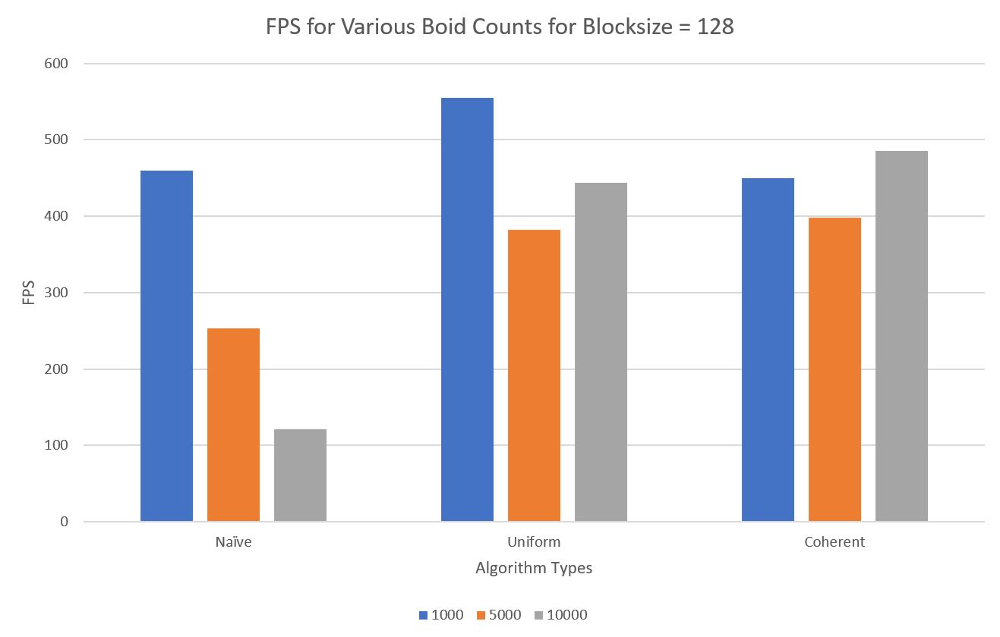
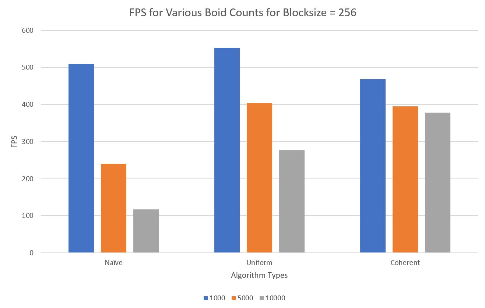
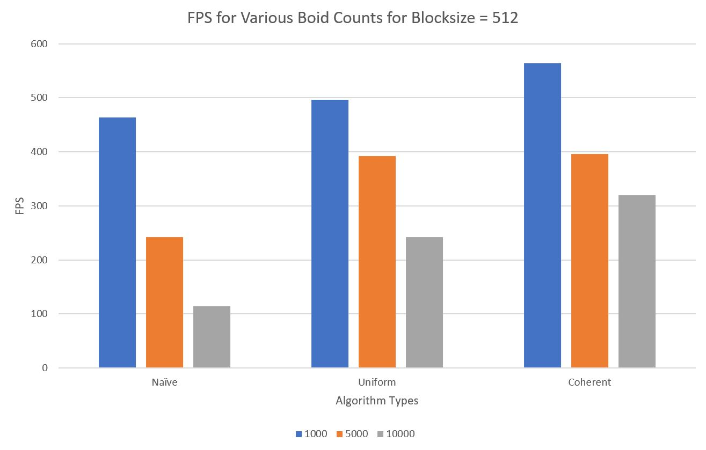

**University of Pennsylvania, CIS 565: GPU Programming and Architecture,
Project 1 - Flocking**

* Ishan Ranade
* Tested on personal computer: Gigabyte Aero 14, Windows 10, i7-7700HQ, GTX 1060

# Boid Simulation

## Features

- Naive implementation
- Uniform grid without coherence
- Uniform grid with coherence
- Performance analysis with various blocksizes and boid counts

## Performance Analysis

Below are graphs for performance for the three algorithms implements for various blocksizes including 128, 256, and 512.

To perform my analysis I recorded down the framerates of the simulation as both the blocksize and number of boids changed for each of the three types of algorithm implemented.  I felt that FPS was the best way to determine which combination produced the best results.

The baseline was the Naive method, and the goal was for each of the other two methods to be able to beat the naive performance.  This would be a good test to determine if using the GPU actually produced better results.

For the Naive method changing the number of boids definitely changed the performance because this method was completely dependendent on boid size and did not make use of the massive parallelism.  For the uniform method, increasing the number of boids made the performance worse in all three cases of blocksizes.  This may be because of the lack of caching when looping through the particles in the surrounding cells.  The coherent method did the best with increasing boid count and this may be due to caching.

In general it seemed that the naive method produced the worst results especially as the number of boids increased.  The block size did not affect this method as it did not make use of the massive parallelism.

The uniform method seemed to do better than the coherent method except for when the blocksize was 512.  The coherent grid showed the best performance especially as the boid size increased.  I was surprised though that at low blocksizes and boid counts it seemed to do worse than the uniform method, but seemed to excel as both the blocksize and boid count increased.